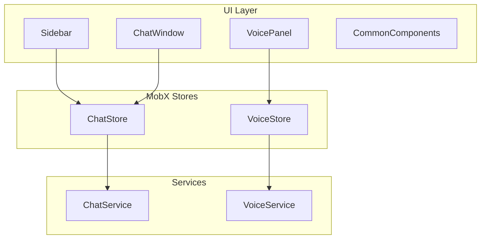
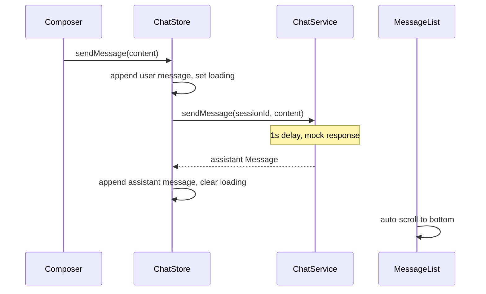

# SynthioChat Implementation Plan

## Current State

The repo is a fresh scaffold on branch `mvp-v1` with React 19, MobX, Tailwind CSS 4, and Vite already configured in [`package.json`](package.json). [`src/App.tsx`](src/App.tsx) is still the default Vite counter template. **No chat, voice, stores, services, or folder structure exist yet.** [`.cursor/memory.md`](.cursor/memory.md) does not exist and will be created at the start of implementation.

## Architecture

Follow the mandated flow from [`.cursor/AGENTS.md`](.cursor/AGENTS.md):



**Store choice:** Use two standalone stores (`ChatStore`, `VoiceStore`) exported from a thin [`src/stores/rootStore.ts`](src/stores/rootStore.ts) for React context provisioning. Avoid a heavy RootStore abstraction unless wiring demands it.

**Data flow for chat:**



## Target Folder Structure

Create the structure defined in both docs under [`src/`](src/):

```
src/
  assets/
  components/
    common/       Button, Loader, Spinner, ErrorBanner, EmptyState, IconButton
    chat/         ChatWindow, ChatHeader, MessageList, MessageBubble, TypingIndicator, MessageComposer, SendButton
    sidebar/      Sidebar, ChatList, ChatItem, NewChatButton
    voice/        VoicePanel, VoiceStatus, Transcript, CallControls
  layouts/        AppLayout.tsx
  pages/          HomePage.tsx
  stores/         chatStore.ts, voiceStore.ts, rootStore.ts, StoreProvider.tsx
  services/       chat.service.ts, voice.service.ts
  hooks/          useAutoScroll.ts (only if reused by MessageList)
  types/          chat.types.ts, voice.types.ts
  utils/          id.ts, storage.ts, date.ts
  constants/      storageKeys.ts, voiceDelays.ts
  styles/         (optional shared CSS if Tailwind gets noisy)
```

Remove/replace the Vite starter content in [`src/App.tsx`](src/App.tsx), [`src/App.css`](src/App.css), and reset [`src/index.css`](src/index.css) to app-level tokens and layout primitives (not the current centered demo layout).

## Icons & Images — Placeholders Only

Do **not** source, design, or integrate real icons, logos, or illustrations during implementation. The user will wire these manually later.

**Rules:**
- Use text labels, empty `<span>` boxes, or simple CSS placeholders (e.g. a bordered square with `aria-hidden="true"`) wherever an icon or image would appear
- Do **not** add icon libraries (Lucide, Heroicons, etc.) or import SVG/image assets for UI chrome
- `IconButton` and similar components should accept an optional `iconPlaceholder` slot or render a neutral placeholder div — not a real icon
- Empty states and voice/chat controls should use text-only UI (e.g. "Send", "Menu", "Start Call") until assets are added manually
- Leave clear hook points for later wiring: e.g. `{/* icon-placeholder: send */}` or a `data-icon="send"` attribute on the placeholder element
- Remove Vite starter demo assets ([`src/assets/react.svg`](src/assets/react.svg), hero images, etc.) rather than reusing them

**Out of scope for AI implementation:** favicons, brand logos, decorative illustrations, avatar images, mic/speaker icons.

## Phase 0 — Memory & Foundation

**Goal:** Establish progress tracking and shared primitives before UI work.

**Create [`/.cursor/memory.md`](.cursor/memory.md)** with this structure (updated after every phase):

```markdown
# SynthioChat Progress

## Current Phase
Phase N — <name>

## Completed
- ...

## In Progress
- ...

## Remaining
- ...

## Files Touched (latest phase)
- ...

## Notes / Decisions
- ...
```

**Implement:**
- [`src/types/chat.types.ts`](src/types/chat.types.ts) — `Message`, `ChatSession` per requirements
- [`src/types/voice.types.ts`](src/types/voice.types.ts) — `VoiceStatus` union type
- [`src/utils/id.ts`](src/utils/id.ts) — `createId()` via `crypto.randomUUID()`
- [`src/utils/storage.ts`](src/utils/storage.ts) — typed localStorage read/write with Date revival
- [`src/constants/storageKeys.ts`](src/constants/storageKeys.ts) — `CHAT_SESSIONS_KEY`
- Reset global styles in [`src/index.css`](src/index.css) for full-viewport app shell (flex layout, CSS variables for light theme)

**Memory update:** Log Phase 0 completion, list created files, set Phase 1 as next.

---

## Phase 1 — Mock Services

**Goal:** Isolate all async/mock behavior from UI and stores.

**[`src/services/chat.service.ts`](src/services/chat.service.ts)**
- `sendMessage(sessionId, content): Promise<Message>` — 1s delay, return mocked assistant reply
- Optional `simulateFailure` flag or random failure path for error-banner testing (controlled, not silent)
- Export typed errors (e.g. `ChatServiceError`)

**[`src/services/voice.service.ts`](src/services/voice.service.ts)**
- `startCall(): AsyncGenerator<VoiceStatus>` or callback-based state machine simulating:
  `disconnected → connecting → connected → listening → speaking → listening → ...`
- `endCall()` — cancel timers, return to `disconnected`
- Append mock transcript lines on `listening` / `speaking` transitions
- Support simulated connection failure for retry UX

**Memory update:** Document mock timings and error simulation approach.

---

## Phase 2 — MobX Stores

**Goal:** All business logic and app state live here; components stay thin.

**[`src/stores/chatStore.ts`](src/stores/chatStore.ts)**
- State: `sessions: ChatSession[]`, `activeSessionId: string | null`, `isLoading: boolean`, `error: string | null`
- Computed: `activeSession`, `activeMessages`, `hasSessions`
- Actions: `createChat()`, `switchChat(id)`, `sendMessage(content)`, `clearError()`, `retryLastMessage()` (if applicable)
- Title logic: first user message truncates to title, else `"New Chat"`
- On `sendMessage`: append user msg immediately, call service, append assistant msg, handle errors without crashing
- Load/save sessions via `storage.ts` (hydrate in constructor or `init()`)

**[`src/stores/voiceStore.ts`](src/stores/voiceStore.ts)**
- State: `status: VoiceStatus`, `transcript: string[]`, `error: string | null`, `isActive: boolean`
- Actions: `startCall()`, `endCall()`, `clearError()`, `retryConnection()`
- Delegate lifecycle to `voice.service.ts`; update status/transcript reactively
- Voice state fully independent from chat store

**[`src/stores/StoreProvider.tsx`](src/stores/StoreProvider.tsx)**
- React context exposing both stores
- Wrap app in [`src/main.tsx`](src/main.tsx)
- Use `observer` from `mobx-react` on consuming components

**Memory update:** List store API surface and persistence hook points.

---

## Phase 3 — Common Components

**Goal:** Reusable UI building blocks before feature components.

| Component | Responsibility |
|-----------|----------------|
| `Button` | Primary/secondary variants, disabled state, a11y label support |
| `IconButton` | Compact actions (mobile menu toggle); renders a CSS placeholder box, not a real icon |
| `Loader` / `Spinner` | Inline loading indicator (CSS-only, no icon assets) |
| `ErrorBanner` | Message + optional retry button |
| `EmptyState` | Centered placeholder text |

Use Tailwind for simple cases; co-locate `.css` files when class strings grow (per AGENTS.md). All interactive elements get accessible labels.

**Memory update:** Note styling conventions chosen (Tailwind vs CSS split).

---

## Phase 4 — Sidebar & Session Management

**Goal:** Chat list, new chat, active highlight, empty state.

**Components:**
- [`Sidebar`](src/components/sidebar/Sidebar.tsx) — container + mobile open/close state (local UI state)
- [`ChatList`](src/components/sidebar/ChatList.tsx) — maps sessions from `ChatStore`
- [`ChatItem`](src/components/sidebar/ChatItem.tsx) — title, active highlight, click → `switchChat`
- [`NewChatButton`](src/components/sidebar/NewChatButton.tsx) — calls `createChat()`

**Empty state:** `"Start a new conversation"` when no sessions.

**Memory update:** Confirm session switch preserves messages per store design.

---

## Phase 5 — Chat Interface

**Goal:** Full text chat UX per requirements.

**Components:**
- `ChatWindow` — orchestrates header, messages, composer, error banner
- `ChatHeader` — active session title
- `MessageList` — scrollable list, auto-scroll hook on new messages
- `MessageBubble` — user (right) vs assistant (left), distinct backgrounds, optional timestamp
- `TypingIndicator` — shown while `chatStore.isLoading`
- `MessageComposer` — textarea: Enter sends, Shift+Enter newline, clears on send
- `SendButton` — disabled when loading or empty input

**Empty state (new chat, no messages):** `"How can I help you today?"`

**UX requirements:**
- Auto-scroll to newest message
- Input clears after send
- Conversation persists when switching chats

**Memory update:** List keyboard behavior and scroll strategy.

---

## Phase 6 — Voice Panel

**Goal:** Independent voice interaction panel with full status lifecycle.

**Components:**
- `VoicePanel` — layout container beside composer area
- `VoiceStatus` — maps status to label: Connecting… / Listening… / Speaking… / Disconnected
- `CallControls` — Start Call / End Call buttons with disabled rules per state
- `Transcript` — scrollable mock transcript lines

**State display mapping:**
- `connecting` → "Connecting..."
- `listening` → "Listening..."
- `speaking` → "Speaking..."
- `disconnected` → "Press Start Call to begin."

**Memory update:** Document voice mock loop timing and end-call cleanup.

---

## Phase 7 — Layout & Responsive Shell

**Goal:** Wire everything into the ChatGPT-like layout from requirements.

**[`src/layouts/AppLayout.tsx`](src/layouts/AppLayout.tsx)**

```
Desktop:  [ Sidebar | Chat Header + Messages + Composer + Voice Panel ]
Tablet:   narrower sidebar
Mobile:   sidebar hidden behind menu; chat full width; voice panel stacks or collapses below composer
```

**[`src/pages/HomePage.tsx`](src/pages/HomePage.tsx)** — composes Sidebar, ChatWindow, VoicePanel inside AppLayout.

**[`src/App.tsx`](src/App.tsx)** — renders `HomePage` only.

**Responsive tactics:**
- CSS flex/grid, no fixed widths
- Mobile: hamburger `IconButton` (placeholder box + `aria-label="Open menu"`) toggles sidebar overlay/drawer
- Tablet breakpoint (~768px): narrower sidebar
- Desktop (~1024px+): full three-column feel

**Memory update:** Breakpoints and mobile drawer behavior.

---

## Phase 8 — Error Handling & Loading Polish

**Goal:** Graceful failures everywhere; app never crashes on API errors.

- Chat: `ErrorBanner` in `ChatWindow` with retry on failure
- Voice: error banner in `VoicePanel` with retry connection
- Ensure loading disables send button and shows typing indicator
- Timeouts/network errors surfaced with user-readable messages

**Memory update:** Error paths covered and retry behavior.

---

## Phase 9 — Persistence (Recommended)

**Goal:** Sessions survive page reload.

- Serialize `ChatSession[]` + `activeSessionId` to localStorage on store changes (MobX `reaction` or explicit save after mutations)
- Revive `Date` fields on load in [`src/utils/storage.ts`](src/utils/storage.ts)
- Voice state does **not** need persistence (per scope)

**Memory update:** Storage key, schema, and hydration edge cases (corrupt data → start fresh).

---

## Phase 10 — Final QA & Definition of Done

Verify all checklist items from [`.cursor/requirements.md`](.cursor/requirements.md):

- Create / switch / persist chats
- Send messages, receive mocked 1s-delay responses
- Typing indicator + disabled send while loading
- Voice start/end with status transitions and transcript
- Loading and error states with retry
- Desktop, tablet, mobile layouts
- Accessibility: button labels, keyboard nav, focus order

Run `pnpm build` and `pnpm lint` to confirm no type or lint errors.

**Memory update:** Mark all phases complete; list any deferred nice-to-haves.

---

## Nice-to-Have (Defer Until Core Done)

Only after Phase 10 passes: timestamps polish, session rename/delete, markdown rendering, copy message, theme toggle, toasts, animations. Do **not** block MVP on these.

---

## Files to Remove or Replace

| File | Action |
|------|--------|
| [`src/App.tsx`](src/App.tsx) | Replace with HomePage wiring |
| [`src/App.css`](src/App.css) | Remove Vite demo styles |
| [`src/index.css`](src/index.css) | Replace with app shell tokens |
| Vite demo assets | Remove; do not replace with new icon/image assets — use placeholders only |

---

## Implementation Conventions (from AGENTS.md)

- **Icons and images:** placeholders only — text labels or empty styled elements; real assets wired manually later (see section above)
- Components call store actions only — never import services directly
- No `useMemo` / `useCallback` / `React.memo` unless measured need
- Split large JSX with render helper functions
- Import order: React → third-party → stores → services → components → hooks → types → utils → styles
- After each phase: update [`.cursor/memory.md`](.cursor/memory.md) with Completed / Remaining / Files Touched summary

## Estimated Increment Order

Each bullet = one implementation session with a memory.md update at the end:

1. Phase 0 — types, utils, memory.md, style reset
2. Phase 1 — services
3. Phase 2 — stores + provider
4. Phase 3 — common components
5. Phase 4 — sidebar
6. Phase 5 — chat interface
7. Phase 6 — voice panel
8. Phase 7 — layout + responsive
9. Phase 8 — errors/loading polish
10. Phase 9 — localStorage persistence
11. Phase 10 — QA + build verification
