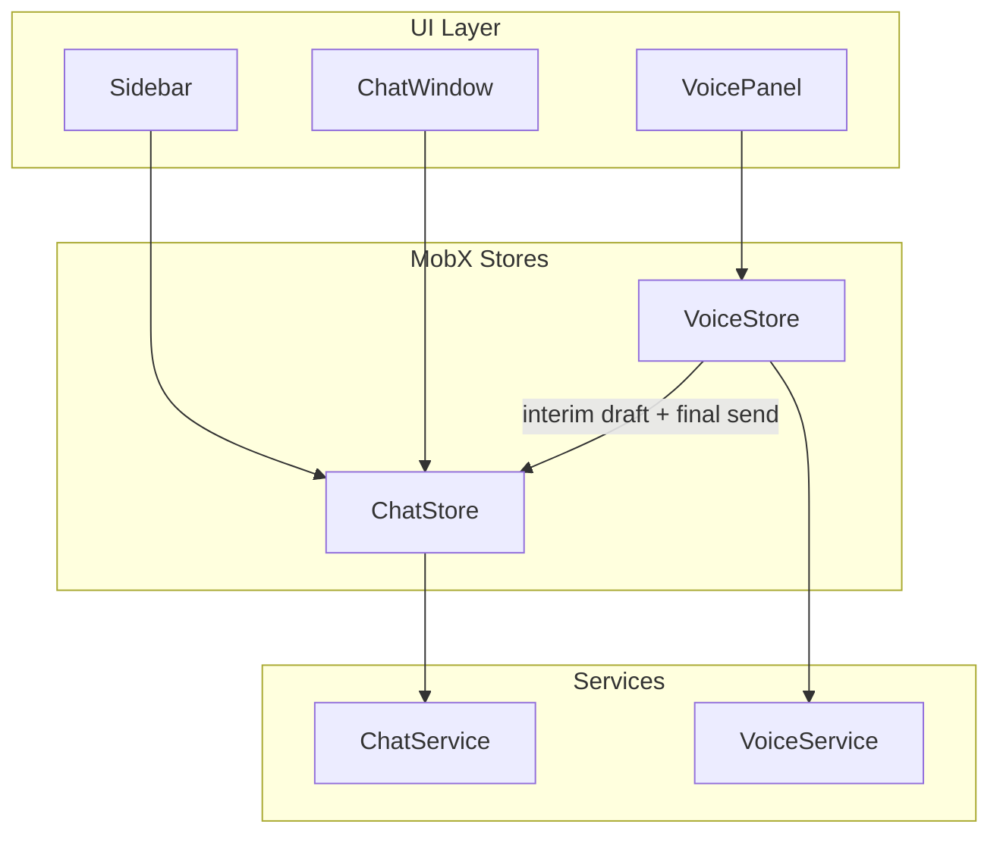
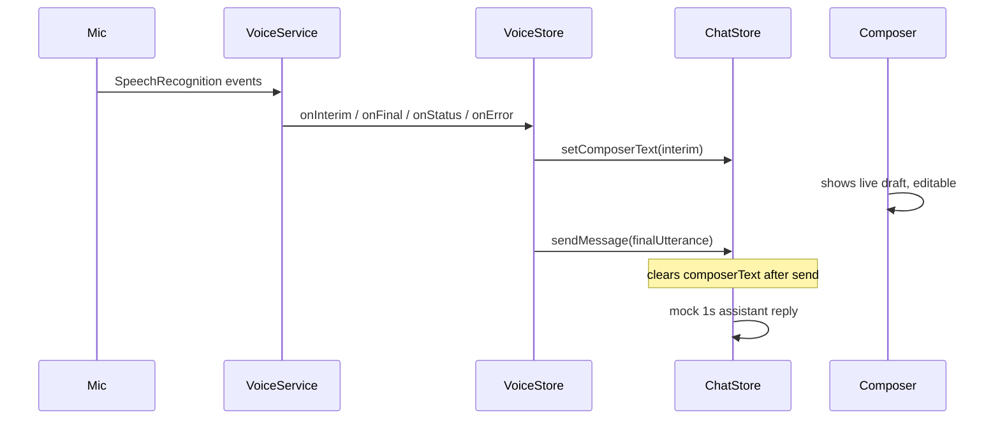

# SynthioChat Implementation Plan (Revised)

## Current State

Branch: **`mvp-pro-v1`**. Stack in [`package.json`](package.json): React 19, MobX, Tailwind CSS 4, Vite 8, React Compiler. [`src/App.tsx`](src/App.tsx) is the Vite demo. No feature code or [`.cursor/memory.md`](.cursor/memory.md) yet.

Do **not** add libraries. Do **not** introduce `useMemo` / `useCallback` / `React.memo`.

Keep [`.cursor/plans/synthiochat_mvp_plan_30d517d5.plan.md`](.cursor/plans/synthiochat_mvp_plan_30d517d5.plan.md) in sync with this plan.

---

## Architecture



**Stores:** `ChatStore` + `VoiceStore` in thin [`rootStore.ts`](src/stores/rootStore.ts). `VoiceStore` receives a `ChatStore` reference from root so STT can update draft / send messages. Components never import services.

**Voice → chat input (confirmed 1C, no TTS):**



---

## Concrete Decisions

| Topic | Decision |
|-------|----------|
| Icons/images | **Placeholders only** — text / CSS boxes / `data-icon`. Wired manually later. No icon libs. |
| Voice transcript | Browser **SpeechRecognition** (`webkitSpeechRecognition` fallback). No mock transcript lines. |
| Assistant audio | **No TTS** (`speechSynthesis` unused). Voice is input-only. |
| Voice → chat (1C) | Interim results **live-fill** `chatStore.composerText` (user can edit). On **final** result (utterance end), **auto-send** via `chatStore.sendMessage`, then clear draft. Manual Send still works anytime. |
| Voice status | `disconnected → connecting → connected → listening`. Keep `speaking` in the type for requirements compatibility but **never transition to it** (no TTS). UI labels omit Speaking. |
| Voice service | Real STT wrapper class: `startCall` / `endCall`, handlers for status, interim, final, error. Capability check before start. |
| Unsupported / mic denied | `ErrorBanner` + retry; text chat remains usable. |
| Chat persistence | Explicit `persist()`; hydrate in constructor — **Phase 9 only**. Phase 2 in-memory. |
| Auto-scroll | Inline in `MessageList`. No single-use hook. |
| Common loading UI | `Spinner` only (no separate Loader). |
| Chat error demo | Message containing `force error` → simulateFailure; retry succeeds. |
| Initial sessions | `sessions = []`; empty copy "Start a new conversation". |
| Theme | Light-only; slate + teal; no purple Vite tokens; no auto dark. |
| Target browsers for voice | Primary: Chromium. Graceful degrade elsewhere. |

---

## Icons & Images — Placeholders Only

Do not source or integrate real icons, logos, or illustrations. User wires assets later.

- Text labels or empty styled boxes with `aria-hidden="true"`, `data-icon="…"`, `{/* icon-placeholder: … */}`
- `IconButton` renders a neutral placeholder square unless children provided
- Remove Vite demo assets (`react.svg`, `vite.svg`, `hero.png`) without replacing them

---

## Target Folder Structure

```
src/
  assets/                 .gitkeep after demo removal
  components/
    common/               Button, Spinner, ErrorBanner, EmptyState, IconButton
    chat/                 ChatWindow, ChatHeader, MessageList, MessageBubble,
                          TypingIndicator, MessageComposer, SendButton
    sidebar/              Sidebar, ChatList, ChatItem, NewChatButton
    voice/                VoicePanel, VoiceStatus, Transcript, CallControls
  layouts/                AppLayout.tsx
  pages/                  HomePage.tsx
  stores/                 chatStore.ts, voiceStore.ts, rootStore.ts, StoreProvider.tsx
  services/               chat.service.ts, voice.service.ts
  types/                  chat.types.ts, voice.types.ts
  utils/                  id.ts, storage.ts, date.ts
  constants/              storageKeys.ts
  styles/                 only if needed later
```

No `voiceDelays.ts` mock loop constants. Optional small `speech.ts` util only if SpeechRecognition typing helpers are shared (prefer keeping wrappers inside `voice.service.ts`).

---

## Phase 0 — Memory & Foundation

Create [`.cursor/memory.md`](.cursor/memory.md) (update every phase):

```markdown
# SynthioChat Progress

## Current Phase
Phase N — <name>

## Completed
- ...

## Files Modified
- ...

## Remaining Work
- ...

## Notes / Decisions
- ...
```

**Implement:** types (`Message`, `ChatSession`, `VoiceStatus`), `createId`, storage helpers, `toDate` / `formatTimestamp` / `truncateTitle`, storage keys, reset [`index.css`](src/index.css) for full-viewport light shell.

`VoiceStatus` union stays: `"disconnected" | "connecting" | "connected" | "listening" | "speaking"` — `speaking` unused in transitions.

---

## Phase 1 — Services

**[`chat.service.ts`](src/services/chat.service.ts)** — unchanged mock: 1s delay, `ChatServiceError`, `simulateFailure`.

**[`voice.service.ts`](src/services/voice.service.ts)** — browser STT:
- `isSpeechRecognitionSupported(): boolean`
- Class `VoiceService` with `startCall(handlers)` / `endCall()`
- Handlers: `onStatus`, `onInterim(text)`, `onFinal(text)`, `onError`
- Use `SpeechRecognition` or `webkitSpeechRecognition`; `continuous: true`, `interimResults: true`
- Status: `connecting` while starting → `connected` once engine starts → `listening` while recognizing → `disconnected` on `endCall` / fatal error
- Never emit `speaking`
- Map permission / not-allowed / network errors to `VoiceServiceError`
- `endCall()` stops recognition and cleans listeners

---

## Phase 2 — MobX Stores (in-memory)

**[`chatStore.ts`](src/stores/chatStore.ts)**
- State: `sessions`, `activeSessionId`, `isLoading`, `error`, `lastFailedContent`, **`composerText`**
- Actions: `createChat`, `switchChat`, `setComposerText`, `sendMessage` (reads/trims text or accepts override string; clears `composerText` on successful queue), `receiveMessage`, `clearError`, `retryLastMessage`
- Title from first user message via `truncateTitle`

**[`voiceStore.ts`](src/stores/voiceStore.ts)**
- State: `status`, `transcript: string[]` (final lines for panel), `interimText`, `error`, `isActive`
- Constructor takes `chatStore` reference
- `startCall` / `endCall` / `clearError` / `retryConnection`
- On interim → `chatStore.setComposerText(interim)` (and keep `interimText` for Transcript UI)
- On final → append to `transcript`, `chatStore.sendMessage(final)`, clear interim
- Skip auto-send if final text empty or `chatStore.isLoading`
- Not persisted

**Provider** in [`main.tsx`](src/main.tsx); `observer` on consumers.

---

## Phase 3 — Common Components

`Button`, `IconButton` (placeholder), `Spinner`, `ErrorBanner`, `EmptyState`. Tailwind + co-located CSS when noisy. Accessible labels.

---

## Phase 4 — Sidebar

`Sidebar`, `ChatList`, `ChatItem`, `NewChatButton`. Empty: **"Start a new conversation"**. Open/close owned by `HomePage`.

---

## Phase 5 — Chat Interface

Controlled composer bound to `chatStore.composerText` so voice and typing share one field.

`MessageComposer`: Enter send, Shift+Enter newline; Send disabled when loading or empty. Empty chat: **"How can I help you today?"** Error banner + retry.

---

## Phase 6 — Voice Panel

`VoicePanel`, `VoiceStatus`, `CallControls`, `Transcript`.

**Labels:** Connecting… / Connected / Listening… / Disconnected. Inactive empty: **"Press Start Call to begin."**

`Transcript` shows final STT lines + optional interim row. Start Call / End Call drive `VoiceStore`. Error banner for unsupported API, mic denied, recognition failures.

---

## Phase 7 — Layout & Responsive Shell

Desktop: sidebar | chat + voice. Tablet: narrower sidebar. Mobile: drawer sidebar; voice below composer. [`App.tsx`](src/App.tsx) → `HomePage` only.

---

## Phase 8 — Error / Loading Polish

Chat + voice banners; unsupported-browser copy; mic retry; send disabled while loading; focus remains usable after retry.

---

## Phase 9 — Persistence

Persist `sessions` + `activeSessionId` only. Corrupt data → fresh start. Voice / composer draft not persisted (or clear draft on hydrate).

---

## Phase 10 — QA & Definition of Done

Requirements checklist plus:
- Start Call → grant mic → Listening; interim text appears in composer
- Final utterance auto-sends as user message; mock assistant reply follows
- User can edit draft mid-speech and/or press Send manually
- End Call stops recognition; status Disconnected
- Unsupported browser: banner, text chat still works
- `pnpm build` + `pnpm lint`

Defer nice-to-haves (rename/delete, markdown, theme toggle, toasts, real icons, TTS).

---

## Known Constraints (documented, not blockers)

- STT best in Chrome/Edge; Safari partial; Firefox often unsupported → degrade with banner
- Requires secure context (`localhost` or HTTPS)
- Recognition quality/silence detection is browser-defined; final-result auto-send is the send trigger

---

## Files to Remove or Replace

| File | Action |
|------|--------|
| [`src/App.tsx`](src/App.tsx) | Replace with HomePage |
| [`src/App.css`](src/App.css) | Delete |
| [`src/index.css`](src/index.css) | App shell tokens |
| Demo assets | Delete; placeholders only |

---

## Implementation Conventions (AGENTS.md)

- UI → Stores → Services; components never import services
- Split large JSX with render helpers
- Import order: React → third-party → stores → services → components → hooks → types → utils → styles
- Extract hooks/utils only when reused
- After each phase: update `memory.md` (Completed / Files Modified / Remaining Work)
